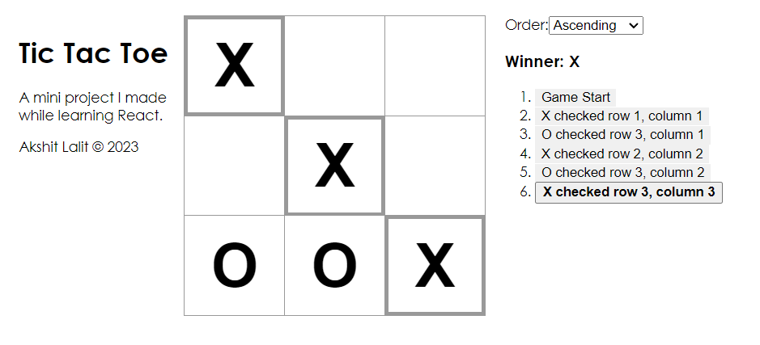

# TicTacToe

- The Tic Tac Toe Game is a web-based application developed using React.js.
- It provides a fun and interactive way to play the classic Tic Tac Toe game against the AI opponent.

- <a href="https://youtu.be/5LpbJYqvHrg">YouTube</a>
- <a href="https://akshit1903.github.io/TicTacToe/">Deployed Link</a>



## Features

- Single Player Mode: Challenge yourself against an AI opponent.
- Interactive Gameplay: Click on the grid to make your moves.
- Win Detection: Automatically detects winning moves and declares a winner.
- Game Reset: Start a new game anytime with the reset option.
- Undo move- Track all your moves and time travel to a previous move.

## Installation

1. Clone the repository:

```bash
    git clone https://github.com/Akshit1903/TicTacToe
```

2. Install the dependencies:

```bash
    cd TicTacToe
    npm install
```

3. Start the application:

```bash
    node start
```

4. Open your web browser and visit `http://localhost:3000` to access the TicTacToe App.

## Technologies Used

- React.js: A JavaScript library for building user interfaces.
- HTML: Markup language for creating the game structure.
- CSS: Stylesheets for enhancing the game's appearance.
